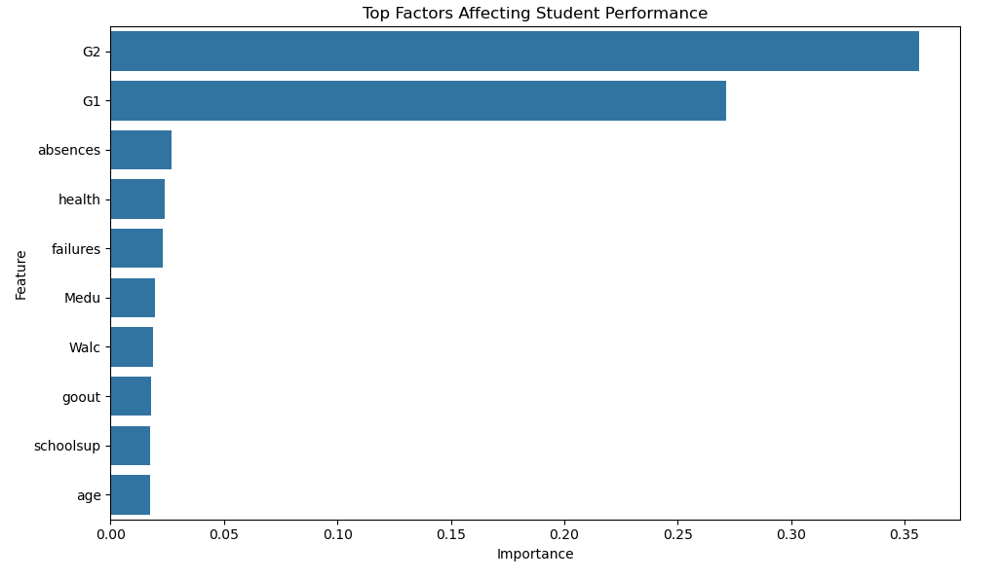

# Student Performance Prediction (Python)

## Table of Contents
- [Brief Summary](#-brief-summary)
- [Overview](#-overview)
- [Problem Statement](#-problem-statement)
- [Dataset](#-dataset)
- [Tools and Technologies](#️-tools-and-technologies)
- [Methods](#️-methods)
- [Key Insights](#-key-insights)
- [Output](#-output)
- [How to Run](#️-how-to-run)
- [Results and Conclusion](#-results-and-conclusion)
- [Future Work](#-future-work)
- [Author and Contact](#-author-and-contact)

## Brief One-Line Summary
A machine learning project that predicts student academic success (pass/fail) using Python.

## Overview
This project analyzes student data to predict whether a student will pass or fail based on academic, personal, and social factors. It demonstrates a complete machine learning workflow including data preprocessing, feature engineering, model training, and evaluation.

## Problem Statement
Educational institutions often face challenges in identifying students at risk of failing. This project aims to build a predictive model that classifies students as pass or fail, enabling early intervention and better academic decision-making.

## Dataset
- Dataset: Student Performance Dataset  
- Source: UCI Machine Learning Repository  
- File: student-mat.csv  
- Includes:
  - Demographics (age, gender)
  - Academic data (study time, failures)
  - Social factors (family support, activities)
  - Grades (G1, G2, G3)

## Tools and Technologies
- Python  
- Jupyter Notebook  
- NumPy  
- Pandas  
- Matplotlib  
- Seaborn  
- Scikit-learn  

## Methods
- Data Cleaning & Missing Value Handling (SimpleImputer)  
- Label Encoding for categorical variables  
- Feature Scaling using StandardScaler  
- Train-Test Split (80/20)  
- Models Used:
  - Logistic Regression  
  - Random Forest Classifier  
- Evaluation:
  - Accuracy Score  
  - Classification Report  

## Key Insights
- Previous grades (G1, G2) are strong predictors  
- Study time and failures impact performance  
- Random Forest performs better than Logistic Regression  
- Feature importance reveals key influencing factors  

## Output
- Prediction:
  - 1 → Pass  
  - 0 → Fail  
- Accuracy scores  
- Classification report  
- Feature importance visualization
  
### Sample Output Visualization

## How to Run This Project

1. Clone the repository  
   git clone https://github.com/romesaaleem/Student-performance-prediction-python

2. Go to project folder  
   cd student_performance_prediction_python  

3. Install dependencies  
   pip install numpy pandas matplotlib seaborn scikit-learn  

4. Update dataset path in code  
   df = pd.read_csv("your_path/student-mat.csv", sep=';')  

5. Run the notebook or Python file  

## Results and Conclusion
- Random Forest achieved higher accuracy  
- Model successfully predicts student performance  
- Useful for identifying at-risk students early  

## Future Work
- Use advanced models (XGBoost, Neural Networks)  
- Hyperparameter tuning  
- Deploy using Flask or Streamlit  
- Use larger datasets  
- Build real-time prediction system  

## Author and Contact
**Name:** Romesa Aleem  
**Email:** romesaaleem29@gmail.com  
**LinkedIn:** https://www.linkedin.com/in/romesa-aleem-4a53b7248/ 
